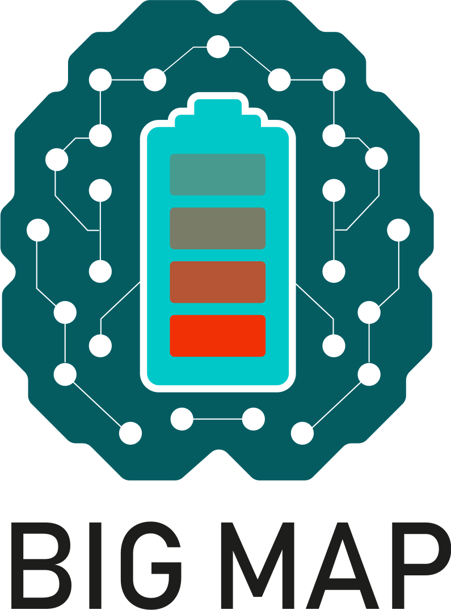

[](https://github.com/emmo-repo/domain-crystallography/actions/)


Battery INterFace Ontology (BattINFO)
=====================================
A battery interface domain ontology based on [EMMO][1].


Status
------
- [x] Proposal
- [ ] Accepted, under development
- [ ] Official

This domain ontology is work-in-progress (WIP), it will be submitted to the EMMC for approval once mature for initial testing.

* Application submitted: TBD
* Application accepted on: TBD


Imported Ontologies
-------------------
This ontology builds on top of EMMO.
See the following table for version compatibilies:

| Imported Ontologies | Version           |
| ------------------- | ----------------- |
| emmo-inferred       | 1.0.0-beta        |


Obtaining domain-batteryInterface
--------------------------------
This ontology builds on top of EMMO.
The correct path to the inferred verion `emmo-inferred` is specified in the catalog file, [`catalog-v001.xml`](catalog-v001.xml).

The domain ontology is obtained with:

```console
git clone https://github.com/BIG-MAP/BattINFO.git
```

When opening BattINFO.ttl in Protégé, the correct version of emmo-inferred will be downloaded and imported.

In EMMO-python correct import is obtained with:

```python
from emmo import get_ontology
# Loading from local repository
ontobatt = get_ontology('/path/to/BattINFO.ttl').load(url_from_catalog=True)
# Loading from web (not yet available due to closed repo)
# ontobatt = get_ontology('https://raw.githubusercontent.com/BIG-MAP/BattINFO/master/BattINFO.ttl').load()
```


Attributions and credits
------------------------

### Contributors
- Francesca Lønstad Bleken, SINTEF
- Jesper Friis, SINTEF
- Simon Clark, SINTEF
- Casper Welzel Andersen, EPFL
- To be added!

### Projects
- [BIG-MAP](http://www.big-map.eu/);
  Grant Agreement No: 957189
  


License
-------
The Battery Interface Domain Ontology is released under the [Creative Commons Attribution 4.0 International](https://creativecommons.org/licenses/by/4.0/legalcode) license (CC BY 4.0).


[1]: https://github.com/emmo-repo/EMMO
