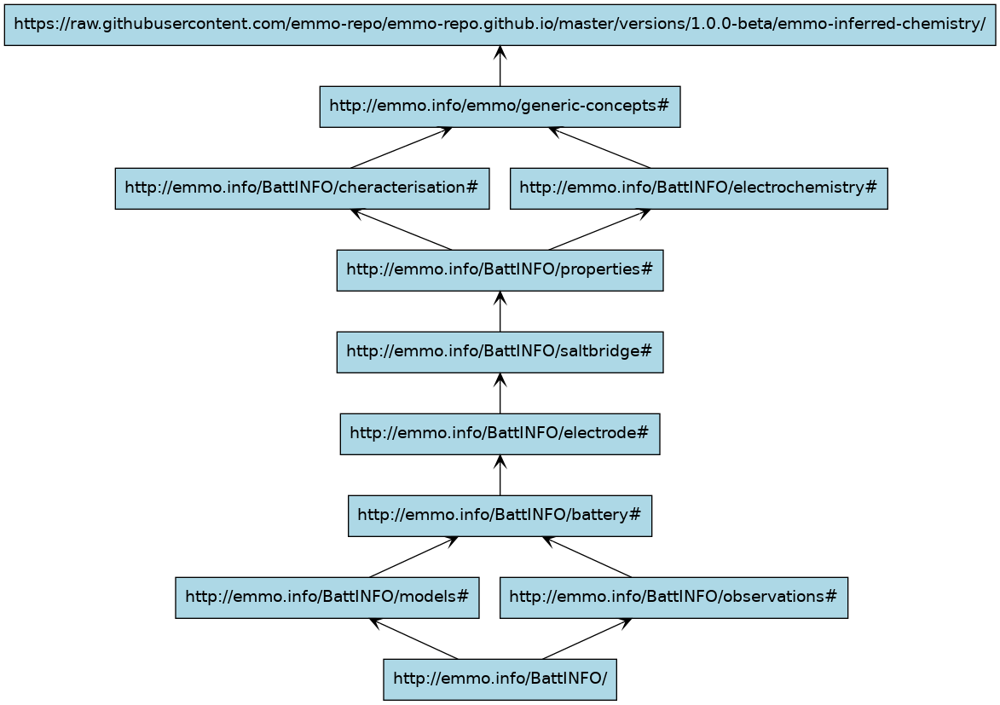

[](https://github.com/emmo-repo/domain-crystallography/actions/)

# Battery INterFace Ontology (BattINFO)

A battery interface domain ontology based on [EMMO][1].

A reference documentation of the individual classes is available in [html](https://big-map.github.io/BattINFO/index.html) and [pdf](https://big-map.github.io/BattINFO/battinfo.pdf) formats.

## Imported ontologies

This ontology builds on top of [EMMO][1].
See the following table for version compatibilies:

| Imported Ontologies      | Version           |
| ------------------------ | ----------------- |
| emmo-inferred-chemistry  | 1.0.0-beta        |

The import structure is shown in the figure below.



## Obtaining BattINFO

This ontology builds on top of [EMMO][1].
The correct path to the inferred verion `emmo-inferred` is specified in the catalog file, [`catalog-v001.xml`](catalog-v001.xml).

The domain ontology is obtained with:

```console
git clone https://github.com/BIG-MAP/BattINFO.git
```

When opening BattINFO.ttl in Protégé, the correct version of emmo-inferred will be downloaded and imported.

In EMMO-python, correct import is obtained with:

```python
from emmo import get_ontology

# Loading from local repository
ontobatt = get_ontology('/path/to/BattINFO/battinfo.ttl').load(url_from_catalog=True)

# Loading from web
ontobatt = get_ontology('https://raw.githubusercontent.com/BIG-MAP/BattINFO/master/battinfo.ttl').load()
```

## Attributions and credits

### Contributors

- Simon Clark, SINTEF, Norway
- Francesca Lønstad Bleken, SINTEF, Norway
- Jesper Friis, SINTEF, Norway
- Casper Welzel Andersen, EPFL, Switzerland
- Eibar Flores, DTU, Denmark
- Martin Uhrin, DTU, Denmark
- Simon Stier, Fraunhofer, Germany
- Marek Marcinek, Warsaw University of Technology, Poland
- Anna Szczesna, Warsaw University of Technology, Poland
- Miran Gaberscek, National Institute of Chemistry, Slovenia
- Deyana Stoytcheva, ICMAB, Spain
- Rosa Palacin, ICMAB, Spain
- Ingeborg-Helene Svenum, SINTEF, Norway
- Inga Gudem Ringdalen, SINTEF, Norway
- Emanuele Farhi, SOLEIL synchrotron, France

### Projects

- [BIG-MAP](http://www.big-map.eu/); Grant Agreement No: 957189 

## License

The Battery Interface Domain Ontology is released under the [Creative Commons Attribution 4.0 International](https://creativecommons.org/licenses/by/4.0/legalcode) license (CC BY 4.0).

[1]: https://github.com/emmo-repo/EMMO
