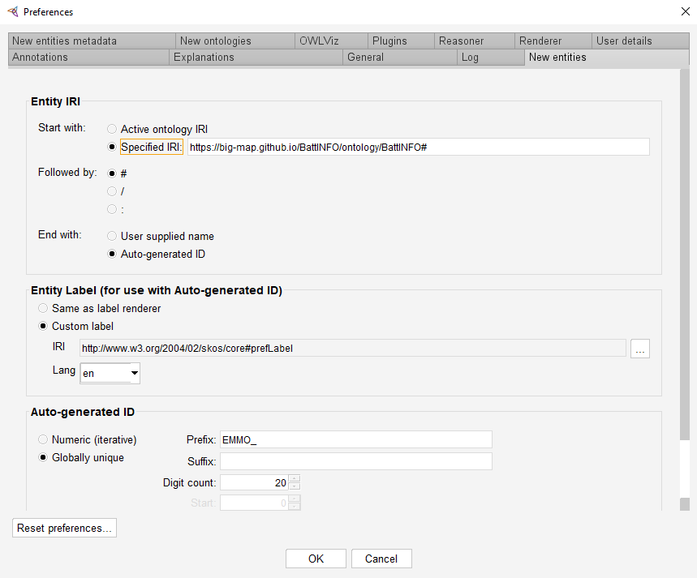

<!-- markdownlint-disable MD033 -->

# Battery INterFace Ontology (BattINFO)

[](https://github.com/BIG-MAP/BattINFO/actions/)

A battery interface domain ontology based on [EMMO][1].

A reference documentation of the individual classes is available in [html](https://big-map.github.io/BattINFO/index.html) and [pdf](https://big-map.github.io/BattINFO/battinfo.pdf) formats.

## Imported ontologies

This ontology builds on top of [EMMO][1].
See the following table for version compatibilies:

| Imported Ontologies      | Version           |
| ------------------------ | ----------------- |
| emmo-inferred-chemistry  | 1.0.0-beta3        |

The import structure is shown in the figure below.


## Obtaining BattINFO

This ontology builds on top of [EMMO][1].
The correct path to the inferred verion `emmo-inferred` is specified in the catalog file, [`catalog-v001.xml`](catalog-v001.xml).

The domain ontology is obtained with:

```console
git clone https://github.com/BIG-MAP/BattINFO.git
```

When opening BattINFO.ttl in Protégé, the correct version of emmo-inferred will be downloaded and imported.

In python, the ontology can be handled with the pacakge [EMMOntoPy][2] (formerly EMMO-python). This
package can be installed with `pip install emmontopy` (not to be confused with ontopy on pypi).

Correct import is obtained with:

```python
from ontopy import get_ontology

# Loading from local repository
battinfo = get_ontology('/path/to/BattINFO/battinfo.ttl').load(url_from_catalog=True)

# Loading from web
battinfo = get_ontology('https://raw.githubusercontent.com/BIG-MAP/BattINFO/master/battinfo.ttl').load()
```

## Contributing to BattINFO
There are two ways you can contribute to BattINFO.
### Suggest minor changes on existing elements
Create a [Feature request in a Github Issue](https://docs.github.com/en/issues/tracking-your-work-with-issues/creating-an-issue) to suggest edits to names, defintions, references on existing classes and properties. 
### Propose additions/deletion of elements
> **_NOTE:_**  We recommend contacting some of BattINFO contributors in advance to discuss which additions deletions you wish to make.  

We recoommend using the [forking workflow](https://www.atlassian.com/git/tutorials/comparing-workflows/forking-workflow) to contribute additions/deletions. Fork this repository, clone the fork on you local PC, create your branch based on the existing ```dev``` branch (e.g. ```dev_john_doe```) and work on the editions in you local copy. You can edit ontologes in two main ways. One is programmatically, using for instance [EMMOntoPy](https://github.com/emmo-repo/EMMOntoPy). The second and more common is using the interface provided by the Protege software. In case of the latter, [install Protege](https://protege.stanford.edu/) and use it to open the ontology file you wish to edit. Before adding elements, ensure Protege is configured to create IRIs in the right format:  
* Open Protégé
* Go to File/Open and load the ontology file you wish to modify
* Go to File/Preferences and there go to the New Entities Tab
* Ensure you have configured the preferences as shown below:
  
Here is the "Specified IRI" for you to copy: ```https://big-map.github.io/BattINFO/ontology/BattINFO#```

* Once you have made your changes, commit them to your fork and [create a pull request](https://docs.github.com/en/pull-requests/collaborating-with-pull-requests/proposing-changes-to-your-work-with-pull-requests/creating-a-pull-request).
* We will merge the request after assessing it.


## Attributions and credits

### Contributors

- Simon Clark, SINTEF, Norway
- Francesca Lønstad Bleken, SINTEF, Norway
- Jesper Friis, SINTEF, Norway
- Casper Welzel Andersen, EPFL, Switzerland
- Eibar Flores, SINTEF, Norway
- Martin Uhrin, DTU, Denmark
- Simon Stier, Fraunhofer, Germany
- Marek Marcinek, Warsaw University of Technology, Poland
- Anna Szczesna, Warsaw University of Technology, Poland
- Miran Gaberscek, National Institute of Chemistry, Slovenia
- Deyana Stoytcheva, ICMAB, Spain
- Rosa Palacin, ICMAB, Spain
- Ingeborg-Helene Svenum, SINTEF, Norway
- Inga Gudem Ringdalen, SINTEF, Norway
- Emanuele Farhi, SOLEIL synchrotron, France

### Projects

- [BIG-MAP](http://www.big-map.eu/); Grant Agreement No: 957189 

## License

The Battery Interface Domain Ontology is released under the [Creative Commons Attribution 4.0 International](https://creativecommons.org/licenses/by/4.0/legalcode) license (CC BY 4.0).

[1]: https://github.com/emmo-repo/EMMO
[2]: https://emmo-repo.github.io/EMMOntoPy
